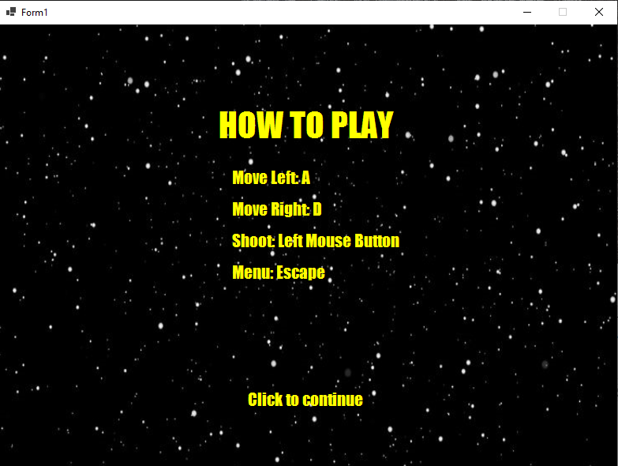

# 🚀 StarFighter 

Вертикальный скролл-шутер на C# с архитектурой MVC.

## 📦 Запуск игры

1. Скачайте проект  
   - Нажмите Code → Download ZIP на главной странице репозитория
   - Распакуйте архив в любую папку

2. Запуск exe-файла  
   - перейдите по следующему пути: StarFighter\bin\Debug\net8.0-windows
   - Запустите файл StarFighter

## 🕹 Управление

### Основное управление
| Действие               | Управление                     |
|------------------------|-------------------------------|
| Движение влево     | Клавиша A или ←           |
| Движение вправо    | Клавиша D или →           |
| Стрельба          | ЛКМ или тачпад (одно касание) |
| Пауза/Меню        | Клавиша ESC                 |
| Рестарт после проигрыша| Клавиша R     |

